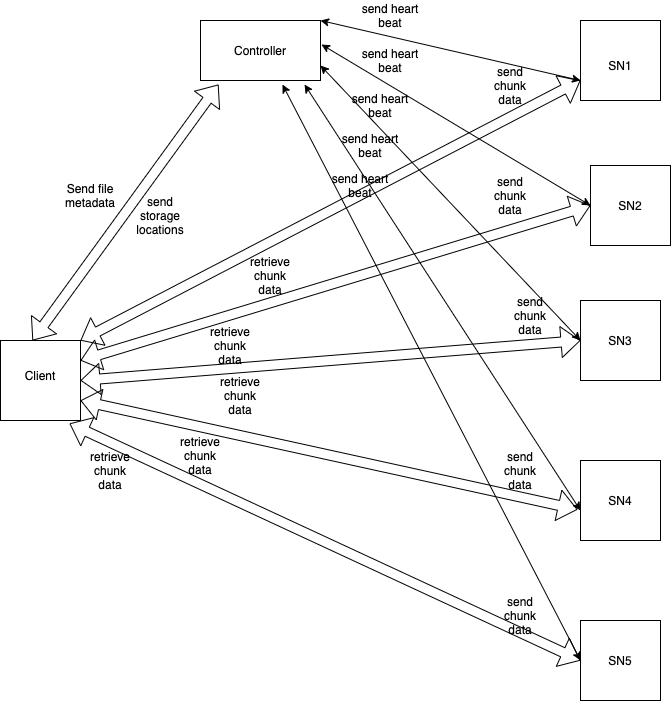

# Distributed File System

## End Points:
### 1. Start Controller
    $ cd hdfs
    $ cd controller
    Sample Request: go run controller.go {port} {directory}
    Usage:          go run controller.go 8000 /home/BigData/Controller
### 2. Start Storage Node
    $ cd hdfs
    $ cd nodes
    Sample Request: go run storagenode.go {controller hostname} {controller port} {port} {directory}
    Usage:          go run storagenode.go 127.0.0.1 8000 8001 /home/BigData/StorageNode1
### 3. Start Client
    $ cd hdfs
    $ client
    Sample Request: go run client.go {controller hostname} {controller port} {port} {directory}
    Usage:          go run client.go 127.0.0.1 8000 8800 /home/BigData/Client\
  #### a. Save File
    Sample Request: /write {file to be saved} {size of each chunk} {folder name}
    Usage:          /write /home/test.pdf 1000 test
  #### b. Retrieve file
    Sample Request: /read {file to be retrieved}
    Usage:          /read test.pdf
  #### c. List active storage nodes
    Sample Request: /list
    Usage:          /list
  #### d. List directories
    Sample Request: /ls {directory name}
    Usage:          /ls  /home/BigData
  #### e. Exit
    Sample Request: /quit or /q
    Usage:          /quit or /q
  #### f. Delete a file
    Sample Request: /delete {file to be deleted}
    Usage:          /delete test.pdf

#### To run client
    cd client/
    go run client.go gamma01 11100 11998 /bigdata/$(whoami)/Client

## Architecture

## Storage Workflow:
    1. Break a file into chunks
    2. Send file metadata(filename, filesize, number of chunks, filechecksum etc..) to Controller and ask Controller where to store the chunks associated with that file
    3. Once controller receives the request from the client:
        a. It checks if that file already exists in bloom filter, if it does 
            then that request to store the file will be rejected
        b. It inserts that file name into bloom filter
        c. It will save the file metadata both in disk(for backup) and in memory
        d. It uses a random generator in order to determine where each chunk and its replicas should go
    4. After receiving a list of locations from controller for each chunk:
        a. for each chunk, client pops a location from that list of locations and sends chunk data, chunk metadata(chunk checksum , chunk size, associated file name etc..) 
        and rest of the locations(replica storage nodes) to the selected location
    5. Once the selected storage node receives a chunk from client:
        a. it saves it
        b. then send that chunk to other storage nodes(i.e. replica storage nodes)
    6. Once other storage nodes receives the replicas it saves it
    7. Each storage node send heartbeats to controller at regular interval:
        a. to confirm the set of chunks that it currently holds
        b. and also to notify the controller that it is still active
    8. Controller once receives the chunks info from storage nodes:
        a. it marks that storage node as active
        b. and it saves the chunk info both in disk(backup) and in memory

## Retrieval Workflow:
    1. Client asks a file from controller
    2. Controller checks for that file in bloom filter:
        a. if it doesnot exist then it will return the error response to client
        b. If it exists, then it will get a list of all the storage nodes associated with that file along with file metadata
    3. Controller sends the list of locations and file metadata back to the client
    4. Client saves the file metadata and sends the retrieval request for each chunk from respective locations
    5. Storgae node once receives the retrieval request:
        a. It will verify if the chunk data requested is valid(by verifying it with the chunk checksum which was saved during storage workflow)
        b. If the chunk is valid then it will be sent to client
        c. If the chunk is not valid:
            i. it will send the request to the controller to retrieve replicas for that corrupted chunk
            ii. once the replicas are received from the controller, it will pop a random storage node from replicas 
                and will request the chunk from that replica
            iii. If the chunk is valid, then it will be sent back to the requested storage node
            iv. If the chunk is not valid, then the step 5 will be repeated till all the replicas are exhausted
    6. Once the client receives the chunk data from the storage node 
            a. it saves it in the disk till all the chunks are received
            b. once all the chunks are received then it merges the chunks(reconstructs the file), 
                and validates the file using its checksum received from the controller in the step 3
                
## Deletion Workflow:
    1. Client asks the controller to delete the file
    2. Controller checks for that file in bloom filter:
        a. if it doesnot exist then it will return the error response to client
        b. If it exists, then it will get a list of all the storage nodes (including replications) associated with that file
    3. Controller sends the deletion request to the storage nodes 
    4. Storgae node once receives the deletion request:
        a. Deletion the chunk from its storage
        b. Send deletion requests to the replication nodes
    5. will be repeated till all the chunks for the file are deleted
    6. Once the storage nodes deletes chunk data, the controller deletes the chunk metadata from its file index and storage
    7. After deletion, it sends a deletion success message to client.

    
    
    
